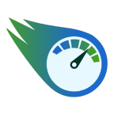
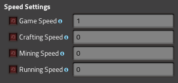

# Speed Settings



[](http://unlicense.org/)

Adds the ability to configure the game speed, along with the player's running, mining and crafting speed in the mod settings.

# Installation

You can install this mod through the built-in modloader of Factorio under the name "Speed Settings". Alternatively, you can manually install it using git or by downloading the source code in .zip format.

***Mod folder (Windows):*** `%appdata%\Factorio\mods`

***Mod folder (Mac OS X):*** `~/Library/Application\ Support/factorio/mods`

***Mod folder (Linux):*** `~/.factorio/mods`

## Installation with Git

```
cd <path to factorio mods>
git clone https://github.com/Diordany/factorio-speed-settings.git speed-settings_1.1.3
```

## Installation from ZIP

Just save the .zip file to the mod directory of Factorio as `speed-settings_1.1.3.zip` (or leave the name as is if downloading from the releases page).

# Usage

Open the mod settings and you'll be able to change the speed settings.

